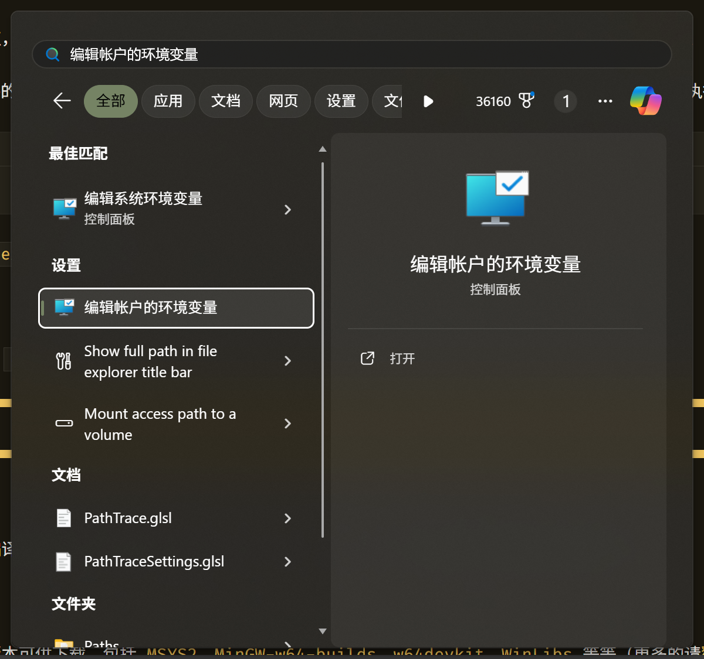
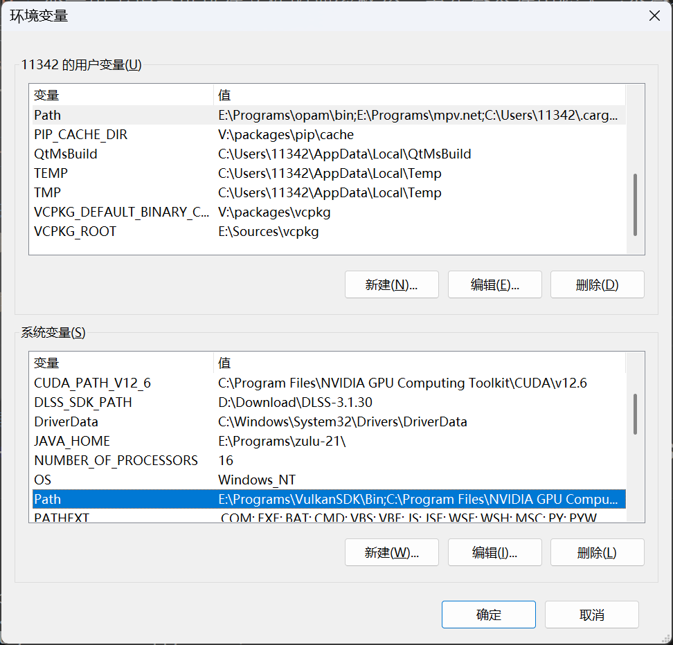
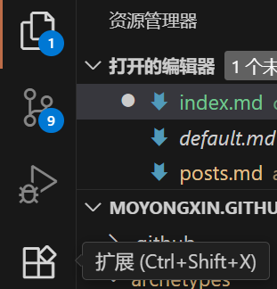
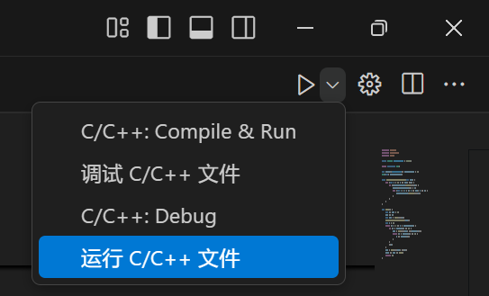

+++
date = '2025-09-07T12:14:10+08:00'
draft = false
title = 'Windows 下配置 VSCode C++ 开发环境的全面指南'
slug = 'vscode-win-cpp'
author = 'qwertyuiop'
cover = ""
tags = ["开发环境"]
keywords = ["vscode", "c++", "windows", "配置", "开发环境"]
readingTime = true
showFullContent = false
hideComments = false
+++

## 前言
[Visual Studio Code](https://code.visualstudio.com/)（简称 VSCode）是一款由微软开发的免费开源代码编辑器，因其轻量级、跨平台和丰富的扩展生态系统而广受欢迎。但是，新手使用 VSCode 进行 C++ 开发（特别是 Windows 环境）常常会遇到配置环境上的困难，同时，网络上的相关教程质量参差不齐，缺乏系统性和实用性。本文旨在为 Windows 用户提供一份足够全面的且易于理解的 VSCode C++ 开发环境配置指南。由于本文篇幅较长，建议读者查看目录后，选择性阅读感兴趣的部分。本文于 Windows 11 x64 上编写和测试。

## 一些概念
在开始配置之前，了解一些基本概念是非常重要的：

### 编译工具链
C++ 作为常规意义上的编译型语言，需要一套编译工具链将源代码转换为可执行文件后，才能运行程序。通常这部分也是新手配置环境时最头疼的地方。

编译工具链通常包括以下组件：
- **编译器（Compiler）**：将 C++ 源代码编译为目标代码（如机器码或中间代码）。
- **链接器（Linker）**：将多个目标代码文件和库文件链接成一个可执行文件。
- **实用工具（Utilities）**：如调试器、`dumpbin`等，辅助开发过程。

Windows 上常见的 C++ 编译工具链有：
- **MinGW-w64**：[GCC](https://gcc.gnu.org/) 的 Windows 移植。包括 `g++` 编译器、`ld` 链接器 和 `gdb` 调试器等工具。
- **Microsoft Visual C++（MSVC）**：微软提供的 C++ 编译器，集成在 Visual Studio 中，支持 Windows 平台的原生开发。包括 `cl.exe` 编译器、`link.exe` 链接器 和 `cdb` 调试器等工具。
- **Clang/LLVM**：一个更新的的编译器套件，支持多种语言和平台以及一些新的特性。包括 `clang++` 编译器、`lld` 链接器 和 `lldb` 调试器等工具。

### VSCode 扩展
VSCode 本身是一个轻量级的代码编辑器，功能主要通过扩展来实现。通过扩展商店即可安装各种插件来增强 VSCode 的功能，包括下面即将介绍的 [Language Server Protocol](#language-server-protocol-lsp)。

### Language Server Protocol (LSP)
[LSP](https://microsoft.github.io/language-server-protocol/) 是一种旨在标准化编辑器（如 VSCode）与[语言服务器](#语言服务器)之间通信的协议，从而实现代码补全、语法检查、错误提示等功能。

### 语言服务器
语言服务器是实现 LSP 的具体工具，负责解析代码并提供相关服务。

### 命令行工具
命令行工具是通过命令行界面（CLI）运行的程序，允许用户通过输入命令来执行各种任务。与之相对的是图形用户界面（GUI）工具，后者通过图形界面和鼠标操作来完成任务。Windows 中可以使用 Windows Terminal 、PowerShell 或者 CMD 等命令行工具（在开始菜单中搜索即可找到）。

### 构建工具
一个软件项目通常由很多源代码文件，以及一些资源文件构成，于是出现了构建工具用于自动化编译、链接和打包等过程，使项目便于管理、使用。

常见的构建工具有：
- **Make**：Unix-like 系统上的经典的构建工具。
- **CMake**：一个跨平台的构建系统生成工具。
- **MSBuild**：微软的构建平台。（由 Visual Studio 使用）

### 环境变量
环境变量是进程运行时的一组动态命名值，以键/值对的形式存在，用于配置操作系统和应用程序的行为。常见的环境变量有 `PATH`、`HOME`、`TEMP` 等。

其中，`PATH` 变量用于指定可执行文件的搜索路径，当在命令行中输入一个命令时，系统会在 `PATH` 指定的目录中查找对应的可执行文件。例如:
```powershell
g++ --version
```
会在 `PATH` 指定的目录中查找 `g++.exe` 文件并执行。

#### 修改环境变量的方法
在开始菜单中搜索 “环境变量” （或者 `env`）：

选择 “编辑帐户的环境变量”，可直接进入环境变量编辑界面：


可以分别看到用户的（上方）和系统的（下方）环境变量。修改用户环境变量影响的范围是该用户运行的程序，系统环境变量影响的范围是整个系统，一般修改用户的就好。需要注意的是，用户的 `Path` 和系统的 `PATH` 会合并在一起使用，用于查找可执行程序，且用户的优先级更高。

选择一个环境变量（如 `Path`）后，点击 “编辑” 按钮，可以看到该变量的各个路径条目，可以通过 “新建”、“编辑”、“删除” 等按钮来管理这些路径条目。添加新的路径时，建议使用绝对路径，避免使用相对路径或包含空格的路径，以防止出现问题。编辑完后可能需要**重启** VSCode 或命令行窗口，才能使修改生效。

## 编译工具链的安装
要想运行 C++ 程序，**必须**先安装一个编译工具链。下面介绍 MinGW-w64、MSVC、Clang 三种常见的编译工具链的安装方法。

### MinGW-w64
[MinGW-w64](https://www.mingw-w64.org/) 有很多预编译（现成）的版本可供下载，包括 [MSYS2](https://www.msys2.org/)、[MinGW-w64-builds](https://github.com/niXman/mingw-builds-binaries/releases)、[w64devkit](https://github.com/skeeto/w64devkit/releases)、[WinLibs](https://winlibs.com/) 等等（更多的请[戳这](https://www.mingw-w64.org/downloads)）。

虽然网络上很多文章推荐 MSYS2，但它的安装和配置相对复杂，且包含了大量不必要的工具和库，容易让新手感到困惑。相比之下，[MinGW-w64-builds](https://github.com/niXman/mingw-builds-binaries/releases) 、 [w64devkit](https://github.com/skeeto/w64devkit/releases) 和 [WinLibs](https://winlibs.com/) 更加轻量级，可能遇到的问题也会更少。

这三者的安装方式都一致（**直接解压缩**到某个目录即可），其中 [w64devkit](https://github.com/skeeto/w64devkit/releases) 使用的是自解压压缩文件，下载 releases 页面中的 `w64devkit-x64-*-7z.exe` 文件后直接双击运行即可解压。解压完后，即可直接使用。如果想要在不使用完整程序名的情况下运行编译器，根据[上述方法](#修改环境变量的方法)将解压目录下的 `bin` 目录添加到 `Path` 环境变量即可。

> Tip #1
>
> MinGW-w64 拥有多种版本，主要区别在于线程模型（`posix`, `win32` 或 `mcf`）、异常处理模型（`seh`、`dwarf` 或 `sjlj`）、链接的 C 语言运行时（`msvcrt` 或 `ucrt`）。一般来说，推荐使用 `posix` 线程模型、`seh` 异常处理模型和 `ucrt` 版本，因为它们在大多数情况下表现更好且兼容性更强。

> Tip #2
>
> 在命令行中使用 `g++ --version` 命令来验证环境变量是否配置成功。若看到版本信息，则表示安装成功。

### Microsoft Visual C++ (MSVC)
MSVC 是微软提供的 C++ 编译器，集成在 Visual Studio 中。安装 [Visual Studio](https://visualstudio.microsoft.com/) 时，可以选择安装 “使用 C++ 的桌面开发” 工作负载，这样会自动安装 MSVC 编译器和相关工具。

同时，微软也提供了独立的 [Build Tools for Visual Studio](https://visualstudio.microsoft.com/visual-cpp-build-tools/)，适合不需要完整 Visual Studio IDE 的用户。安装时同样选择 “使用 C++ 的桌面开发” 工作负载。

安装完毕后，可以通过 `x64 Native Tools Command Prompt for VS *`（在开始菜单中搜索）来使用 MSVC 工具链。

### Clang/LLVM
[LLVM 官方发布页面](https://llvm.org/releases/) 提供了 Windows 版本的 Clang/LLVM（完整的 LLVM 套件：`LLVM-*-win64.exe`；仅 Clang+LLVM `clang+llvm-*-x86_64-pc-windows-msvc.tar.xz`）。下载并安装（对于 `.tar.xz`，解压）后，同样可以将安装目录下的 `bin` 目录添加到 `Path` 环境变量中，并使用`clang++ --version` 命令来验证配置是否成功。

> 注意
>
> Clang **默认**使用 MSVC 的链接器等组件，因此默认情况下**需要**先安装 MSVC 工具链。
> 若想摆脱 MSVC, 可查看 [LLVM 官方论坛里的帖子](https://discourse.llvm.org/t/using-clang-on-windows-without-using-msvc-link/4359)

## VSCode 的安装与配置

### VSCode 的安装
从 [VSCode 官方网站](https://code.visualstudio.com/) 下载最新版本的安装包并安装即可。安装过程中可以选择添加到右键菜单、将 VSCode 添加到 `PATH` 等选项，建议全部勾选。

### 关于 C++ 的扩展
VSCode 本身**并不直接支持** C++ 语言的智能感知、调试等功能，这些功能主要通过扩展来实现。以下是一些常用的 C++ 相关扩展：
- **C/C++**(Microsoft)：提供基本的 C/C++ 语言支持，包括语法高亮、代码补全、调试等功能。
- **clangd**(LLVM)：基于 Clangd 语言服务器，提供更强大的代码补全和错误检查功能（但不包含调试支持，可能需要与 C/C++ 扩展配合使用，且不推荐在单文件项目使用）。
- **C/C++ Compile Run**(danielpinto8zz6)：提供一键编译和运行 C/C++ 代码的功能，适合单文件程序（如算法竞赛等）。

### VSCode 扩展安装
打开 VSCode 后，点击左侧的扩展图标（或按 <kbd>Ctrl</kbd>+<kbd>Shift</kbd>+<kbd>X</kbd>），在搜索栏中输入扩展名称（如 `C/C++`），找到对应的扩展后点击 “安装” 按钮即可。


> Tip #1
>
> 安装扩展后，可能需要重启 VSCode 才能使扩展生效。

> Tip #2
>
> 如果界面是英文的，可以安装 [Chinese (Simplified) Language Pack for Visual Studio Code](https://marketplace.visualstudio.com/items?itemName=MS-CEINTL.vscode-language-pack-zh-hans) 扩展来切换为简体中文界面。

> Tip #3
>
> VSCode 的设置可以通过点击左下角齿轮图标并选择 “设置” 进入，或者按 <kbd>Ctrl</kbd>+<kbd>,</kbd> 快捷键进入。设置界面分为 “用户” 和 “工作区” 两种级别，前者影响所有项目，后者仅影响当前打开的项目。可以通过搜索栏快速查找需要修改的设置项。

### C/C++ 扩展的配置
打开 C/C++ 扩展配置（按 <kbd>Ctrl</kbd>+<kbd>Shift</kbd>+<kbd>P</kbd>，输入 `edit configurations` 并选择 `C/C++: 编辑配置（UI）` 后，可以进行以下配置：
- 更改使用的编译器
- 更改使用的 C++ 标准
- 等等


我们需要确保编译器路径（界面往右拉有下拉菜单，里面是自动探测到的编译器）指向正确的编译器可执行文件（如 `gcc.exe`、`g++.exe`、`cl.exe`（即 MSVC，注意要选择路径为 `*/Hostx64/x64/cl.exe` 的编译器） 或 `clang++.exe`），然后选择对应的 `Intellisense 模式`(MSVC -> `windows-msvc-x64`, clang -> `windows-clang-x64`, GCC -> `windows-gcc-x64`)，并根据需要设置 `C++ 标准`（如 `c++17`、`c++20` 等）。

现在，打开一个文件夹（`文件` -> `打开文件夹...`），新建一个 C++ 文件（如 `main.cpp`），输入一些代码（如 `#include <iostream>`），如果看到语法高亮和代码补全等功能正常工作，说明配置成功。

### clangd 扩展的配置
clangd 扩展配置更加困难一些。倘若使用 clangd, 安装好扩展后，会提示与 C/C++ 扩展的 Intellisense 冲突，可以选择禁用 C/C++ 扩展的 Intellisense 功能（在弹出的通知中禁用或在 C/C++ 扩展配置界面中将 `Intellisense 模式` 设置为 `禁用`）。同时，clangd 会自动下载 `clangd` 可执行文件，需等待下载完成。

clangd 需要一个 `compile_commands.json` 文件来了解项目的编译选项。这个文件通常由构建工具（如 CMake）生成。如果没有使用构建工具，可以手动创建一个简单的 `compile_flags.txt` 文件控制编译参数，一行一个，如：
```plaintext
-std=c++20
-pedantic
```
> 注意
>
> 即便可以使用 `compile_flags.txt`，但推荐使用 `compile_commands.json`，因为它能提供更全面的编译信息。同时，如果没有 `compile_commands.json`，clangd **常常**找不到正确的包含目录（如在使用 MinGW 时，使用了 MSVC 的头文件），且难以配置得当，因而，在单文件项目中，不推荐使用 `clangd`。

如果找不到 `compile_commands.json`，可以在 VSCode 设置中指定其路径（搜索 `clangd: Compile Commands`），或者将其放在项目根目录下。

即使找到 `compile_commands.json`，也可能会遇到 clangd 找不到标准库头文件的问题。这通常是因为 clangd 需要配置 `--query-driver` 参数来确认这个编译器是可以安全执行的。可以在 VSCode 设置中搜索 `clangd: Arguments`，添加类似以下内容：
```plaintext
--query-driver=你的编译器的完整路径
```

> Tip
>
> 打开命令面板（<kbd>Ctrl</kbd>+<kbd>Shift</kbd>+<kbd>P</kbd>），输入 `restart language server` 并选择 `clangd: restart language server`，可以重启 clangd 语言服务器，应用新的配置。

### 关于单文件项目的编译和运行
VSCode 本身并不包含编译和运行代码的功能，这些功能通常通过任务和启动（Tasks and Launches）或扩展来实现。下面介绍两种常见的方法：

#### 扩展（推荐）
安装 **C/C++ Compile Run** 扩展后，可以通过命令面板运行 `C/C++: Compile & Run` 或打开右上角运行菜单来编译和运行当前文件（以 `C/C++:` 开头的才是**该扩展提供的**功能！另两个是 **C/C++** 扩展提供的**基于任务**的运行功能）。该扩展会自动检测使用的编译器，并生成相应的编译命令。


若需更改使用的编译器、参数等，可以在 VSCode 设置中搜索 `Compile Run`，进行相应配置。

> Tip #1
>
> 在命令面板中可以选择带 `(External Terminal)` 的命令，在外部终端（如 Windows Terminal）中运行程序，避免在 VSCode 内置终端中运行时遇到的一些问题（如输入输出异常等）。

> Tip #2
>
> 可以在左下角齿轮图标中选择 `键盘快捷方式`，或依次按 <kbd>Ctrl</kbd>+<kbd>K</kbd> <kbd>Ctrl</kbd>+<kbd>S</kbd> 打开快捷键设置界面，搜索 `Compile Run`，为想要的命令设置一个快捷键，以便快速编译和运行当前文件。

#### 任务（不推荐）
待更新……

### 调试程序
待更新……

### CMake 的配置
待更新……

<!-- CC-BY-SA 4.0 -->
"[Windows 下配置 VSCode C++ 开发环境的全面指南](https://blog.moyongxin.top/posts/vscode-win-cpp.md)" &copy; 2025 by [moyongxin](https://github.com/moyongxin) is licensed under [CC BY-SA 4.0](https://creativecommons.org/licenses/by-sa/4.0)
{ style="color: color-mix(in srgb,var(--foreground) 65%,transparent); margin-bottom: 0px;" }
