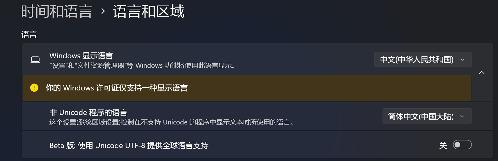

+++
date = '2025-09-09T10:40:15+08:00'
draft = false
title = '关于 Windows 中文环境字符集和本地化的一些问题的分析及解决方案'
slug = 'windows-charset'
author = 'qwertyuiop'
tags = ["本地化"]
keywords = ["windows", "字符集", "编码", "本地化", "locale", "代码页", "中文"]
readingTime = true
showFullContent = false
hideComments = false
+++

## 前言
在使用 Windows 操作系统进行软件开发时，尤其是在处理中文文本（或其他语言的文本）时，常常会遇到各种字符集和本地化相关的问题，这些问题包括但不限于乱码、无法正确显示中文字符、文件名错误等，给用户带来诸多不便。本文将深入分析 Windows 中文环境下字符集和本地化的一些常见问题，并提供相应的解决方案。

## Windows 代码页
Windows 使用代码页（Code Page）来定义字符集和编码方式。代码页是一个数字标识符，表示一组字符的编码方案。不同的代码页支持不同的字符集，例如：
- 936：简体中文（GBK）（中文系统默认值）
- 65001: UTF-8
- 1252：Latin-1

给定代码页，可通过 Windows API （`MultiByteToWideChar` 和 `WideCharToMultiByte`）进行宽字符（UTF-16）和窄字符（以一个字节为单位）转换。

通过 `GetACP` 函数可以获取当前系统使用的代码页。通过 `SetConsoleCP` 和 `SetConsoleOutputCP` 可以分别设置控制台的输入和输出代码页。

### 强制使用 UTF-8 代码页
从 Windows 10 1903 版本开始，微软引入了一个新的功能，允许用户将程序的代码页设置为 UTF-8（代码页 65001）。这可以通过“设置” -> “时间与语言” -> “语言与区域” -> “Windows 显示语言”的下拉菜单 -> 勾选“Beta版：使用 Unicode UTF-8 提供全球语言支持”来实现（此为 Windows 11 的设置应用，可在控制面板中找到类似的设置）。


## Windows API 与字符集
Windows API 一般提供两种版本的函数：一种是 ANSI 版本（A 版本），另一种是 Unicode 版本（W 版本）。ANSI 版本使用系统的当前代码页（Code Page）来处理字符串（字符类型为 `char`），而 Unicode 版本使用 UTF-16 编码（字符类型为 `wchar_t`）。
例如，`CreateFileA` 是 ANSI 版本，而 `CreateFileW` 是 Unicode 版本。
同时，Windows 还提供了一些宏（如 `CreateFile`），根据是否定义宏 `UNICODE` 自动选择调用相应的版本。

在[微软古早的文档](https://learn.microsoft.com/en-us/windows/win32/intl/conventions-for-function-prototypes)当中，建议应用程序使用 Unicode 版本的 API，显式地使用宽字符以及指定代码页来处理文本：
> New Windows applications should use Unicode to avoid the inconsistencies of varied code pages and for ease of localization. They should be written with generic functions, and should define UNICODE to compile the functions into Unicode functions. In the few places where an application must work with 8-bit character data, it can make explicit use of the functions for Windows code pages.
> -- [Windows Learn](https://learn.microsoft.com/en-us/windows/win32/intl/unicode-in-the-windows-api)

> Note
>
> 某些较新的 API 仅提供 Unicode 版本，例如 `LCIDToLocaleName`。

## 程序中的文本编码
C/C++ 编译器通常支持多种源文件编码格式，如 UTF-8、GBK 等。为了确保程序能够正确处理中文文本，建议使用 UTF-8 编码保存源文件，并在编译器中指定相应的编码选项（如 `-finput-charset=<字符集>`（GCC/Clang）、`/source-charset:<字符集>`（MSVC））。

此外，编译器可能会将源文件中的字符串字面量转换为特定的编码格式，表现为可执行文件中的文本以某种编码储存。对应的，各大编译器也有选项控制可执行文件中的文本的实际编码，如 MSVC 的 `/execution-charset:<字符集>` 选项、GCC/Clang 的 `-fexec-charset=<字符集>` 选项。

## 命令行参数的本地化问题
下面我们通过分析现代 Windows 的 C 运行时 [ucrt](https://devblogs.microsoft.com/cppblog/introducing-the-universal-crt/) 的源码来了解 Windows 中文环境下的一些本地化问题。本节的为命令行参数的本地化问题。

### 进程启动时的默认 locale
在 `main()` 函数被调用之前，ucrt 会初始化 locale，使用系统默认的 locale:
```cpp
// locale\get_qualified_locale.cpp:
BOOL __cdecl __acrt_get_qualified_locale(const __crt_locale_strings* lpInStr, UINT* lpOutCodePage, __crt_locale_strings* lpOutStr)
{
    ...
    //  if language defined ...
    if (*_psetloc_data->pchLanguage)
    ...
    else
    {
        //  language is an empty string, use the User Default locale name
        GetLocaleNameFromDefault(_psetloc_data);
    }
    ...
}

static void GetLocaleNameFromDefault (__crt_qualified_locale_data* _psetloc_data)
{
    wchar_t localeName[LOCALE_NAME_MAX_LENGTH];
    _psetloc_data->iLocState |= (__LOC_FULL | __LOC_LANGUAGE);

    // Store the default user locale name. The returned buffer size includes the
    // terminating null character, so only store if the size returned is > 1
    if (__acrt_GetUserDefaultLocaleName(localeName, LOCALE_NAME_MAX_LENGTH) > 1)
    {
        _ERRCHECK(wcsncpy_s(_psetloc_data->_cacheLocaleName, _countof(_psetloc_data->_cacheLocaleName), localeName, wcslen(localeName) + 1));
    }
}
```
其中 `__acrt_GetUserDefaultLocaleName` 调用了 Windows API `GetUserDefaultLocaleName` 来获取系统的默认 locale 名称。在中文系统上，这个名称通常是 `zh_CN.GBK`。

### 命令行参数的编码转换
在 `main(...)` 函数被调用之前，ucrt 会调用 `GetCommandLineA` 来获取命令行参数的 ANSI 版本，并用其填充 `argv` 数组：
```cpp
// startup\argv_data.cpp:
bool __cdecl __acrt_initialize_command_line()
{
    _acmdln = GetCommandLineA();
    _wcmdln = GetCommandLineW();
    return true;
}
```
其中 `_acmdln` 是 ANSI 版本（`main`）的命令行参数，`_wcmdln` 是 Unicode 版本（`wmain`）的命令行参数。而为可移植性考虑，C 程序一般使用 `main` 函数作入口点。因此 `argv` 数组最终会使用 `GetCommandLineA` 的结果来填充。而 `GetCommandLineA` 返回的字符串是使用当前系统代码页（在中文系统上通常是 GBK）编码的，这可能会导致在处理包含非 ASCII 字符的命令行参数时出现问题。

## 文件路径的编码问题
这里仅讲解使用标准 C/C++ 库（如 `fopen`、`fstream` 等）处理文件路径时可能遇到的问题。

Windows 文件系统使用 UTF-16 编码来表示文件路径，因此，
在 ucrt 实现的文件打开逻辑中，窄字符的函数版本经过一系列的分发函数后，最终会调用 `_sopen_nolock` 函数：
```cpp
// lowio\open.cpp:
extern "C" errno_t __cdecl _sopen_nolock(
    int*        const punlock_flag,
    int*        const pfh,
    char const* const path,
    int         const oflag,
    int         const shflag,
    int         const pmode,
    int         const secure
    )
{
    // At this point we know path is not null already
    __crt_internal_win32_buffer<wchar_t> wide_path;

    errno_t const cvt = __acrt_mbs_to_wcs_cp(path, wide_path, __acrt_get_utf8_acp_compatibility_codepage());

    if (cvt != 0) {
        return -1;
    }

    return _wsopen_nolock(punlock_flag, pfh, wide_path.data(), oflag, shflag, pmode, secure);
}
```
将传入的路径转换为宽字符后，随后再调用 `_wsopen_nolock` 函数来打开文件。
其中 `__acrt_get_utf8_acp_compatibility_codepage` 函数会根据当前系统的代码页返回相应的代码页（此处忽略 `CP_OEMCP` 的处理逻辑）：
```cpp
// inc\corecrt_internal_win32_buffer.h:
inline unsigned int __acrt_get_utf8_acp_compatibility_codepage()
{
    _LocaleUpdate locale_update(nullptr);
    unsigned int const current_code_page = locale_update.GetLocaleT()->locinfo->_public._locale_lc_codepage;

    if (current_code_page == CP_UTF8) {
        return CP_UTF8;
    }
    ...
    return CP_ACP;
}
```
可以看到，若当前 C locale 使用 UTF-8 代码页，则使用 UTF-8 代码页，否则使用系统默认的 ANSI 代码页（GBK）。这就导致了在中文系统上，倘若使用 `zh_CN.UTF-8` 或 `en_US.UTF-8` 等 UTF-8 代码页的 locale，程序会使用 UTF-8 代码页来处理文件路径。但是，假如将传入的命令行参数作为文件路径来使用，则会因为[命令行参数一般使用 GBK 编码](#命令行参数的编码转换)而导致路径解析错误。

## 以上问题的解决方案（使用 UTF-8 代码页）
虽然使用 Unicode 版本的 Windows API 或 C 运行时函数可以避免上述问题，但在实际开发中，我们一般不使用 Unicode 版本的 C 运行时函数（如 `_wfopen`）来处理文件路径，因为这会影响程序的可移植性（如 Linux 下 `_wfopen` 并不存在）。因此，我们需要一种方法来确保命令行参数和文件路径都使用 UTF-8 编码，从而避免上述问题。
Windows 10 1903 版本及更高版本不仅允许[强制设置系统默认代码页为 UTF-8](#强制使用-utf-8-代码页)，还允许程序将当前进程代码页设置为 UTF-8（代码页 65001）。

根据[微软官方文档](https://learn.microsoft.com/en-us/windows/apps/design/globalizing/use-utf8-code-page)，我们可通过[应用程序清单文件](https://learn.microsoft.com/en-us/windows/win32/sbscs/application-manifests)，设置进程的代码页为 UTF-8：
```xml
<assembly xmlns="urn:schemas-microsoft-com:asm.v1" manifestVersion="1.0" xmlns:asmv3="urn:schemas-microsoft-com:asm.v3">
 ...
  <asmv3:application>
    <asmv3:windowsSettings xmlns="http://schemas.microsoft.com/SMI/2019/WindowsSettings">
      <activeCodePage>UTF-8</activeCodePage>
    </asmv3:windowsSettings>
  </asmv3:application>
 ...
</assembly>
```
如此一来，`GetCommandLineA` 返回的字符串将使用 UTF-8 编码，从而减少了命令行参数中的编码的不确定性问题。

### 将清单文件放在可执行文件的目录下
将上述清单文件保存为 `<your_program.exe>.manifest`，并与可执行文件 `<your_program.exe>` 放在同一目录下。

### 使用 `.rc` 资源文件包含清单文件
```rc
CREATEPROCESS_MANIFEST_RESOURCE_ID RT_MANIFEST "<your_program.exe>.manifest"
```

### 使用编译器选项嵌入清单文件
对于 MSVC 编译器，可以使用 `/manifestinput:your_program.exe.manifest` 选项将清单文件嵌入到可执行文件中。

### 使用 `mt.exe` 工具嵌入清单文件
```powershell
mt.exe -manifest your_program.exe.manifest "-outputresource:your_program.exe;1"
```

<!-- CC-BY-SA 4.0 -->
"[关于 Windows 中文环境字符集和本地化的一些问题的分析及解决方案](https://blog.moyongxin.top/posts/windows-charset/index.md)" &copy; 2025 by [moyongxin](https://github.com/moyongxin) is licensed under [CC BY-SA 4.0](https://creativecommons.org/licenses/by-sa/4.0)
{ style="color: color-mix(in srgb,var(--foreground) 65%,transparent); margin-bottom: 0px;" }
